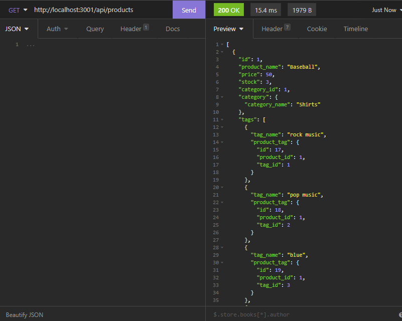

# E-Commerce Back end

## Description 
Backend operations for an e-commerce site, keep track e-commerce database and update as needed. This is done through the power of various resources with a focus on sequelize 

## Installation
You will need to use the following command: "npm install express sequelize mysql2"

## Built with 

- sequelize
- express.js
- node.js
- mysql
## Screenshot

## Video Link

https://watch.screencastify.com/v/fx2O8Wktb9UZ6rjWdDXt

